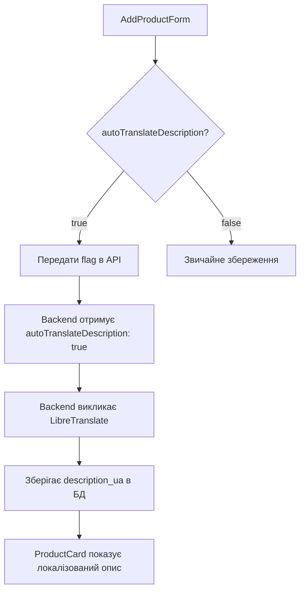

# 🎉 Система автоперекладу товарів - Готова!

## 📋 Що було зроблено

### ✅ **Frontend компоненти готові**

1. **AddProductForm.tsx** - додано checkbox автоперекладу:
   ```tsx
   <Checkbox
     id="autoTranslateDescription"
     checked={autoTranslateDescription}
     onCheckedChange={(checked) => onAutoTranslateDescriptionChange?.(!!checked)}
   />
   ```

2. **useAdmin.ts** - додано стейт управління:
   ```typescript
   const [autoTranslateDescription, setAutoTranslateDescription] = useState<boolean>(false);
   ```

3. **API Route** (`/api/translate/route.ts`) - проксі до backend:
   ```typescript
   // Форвардить запити на ${BACKEND_URL}/api/translate
   sourceLanguage, targetLanguage, text
   ```

4. **useProductTranslation.ts** - хук для роботи з перекладами:
   ```typescript
   const { translateDescription, getLocalizedDescription } = useProductTranslation();
   ```

5. **ProductDescription.tsx** - компонент для відображення локалізованого опису
6. **Типи оновлено** - додано `description_en`, `description_ua` до Product interface

### ✅ **Backend інтеграція налаштована**

- Frontend передає `autoTranslateDescription: true` при створенні продукту
- API proxy перенаправляє `/api/translate` на ваш backend
- Підтримка LibreTranslate через backend

### ✅ **Локалізація готова**

Додано переклади:
```json
// en.json & uk.json
"translation": {
  "autoTranslate": "Auto-translate description",
  "willTranslate": "Description will be automatically translated to Ukrainian when saving",
  "translated": "Translated",
  "original": "Original"
}
```

## 🚀 **Як тестувати**

1. **Запустіть ваш backend на порті 3000**
2. **Запустіть frontend**: `npm run dev`  
3. **Відкрийте Admin панель**
4. **Додайте новий продукт**:
   - Введіть опис англійською
   - ✅ Увімкніть "Auto-translate description"
   - Натисніть Save
   
**Результат**: Backend автоматично створить переклад в `description_ua`

## 🔗 **Як це працює**



## 📝 **Повідомлення для backend розробника**

**✅ Frontend готовий!** Ваша система автоперекладу інтегрована.

**Що frontend передає:**
- `autoTranslateDescription: true` в payload при створенні продукту
- Запити перекладу на `/api/translate` з параметрами:
  - `text` - текст для перекладу
  - `sourceLanguage` - мова джерела (auto-detect)
  - `targetLanguage` - цільова мова (uk)

**Що frontend очікує:**
- Поле `description_ua` в відповіді API для продуктів
- Структуру відповіді translate API:
  ```json
  {
    "translatedText": "Перекладений текст",
    "sourceLanguage": "en",
    "targetLanguage": "uk"
  }
  ```

## 🎯 **Наступні кроки**

1. **Тестування** - перевірте з backend що все працює
2. **Додаткові мови** - можна легко додати інші мови
3. **Кешування** - можливо додати кеш перекладів
4. **Bulk операції** - масовий переклад існуючих товарів

**Система готова до роботи!** 🚀